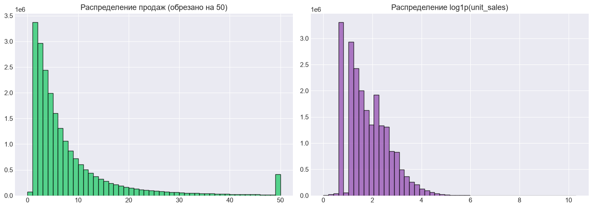
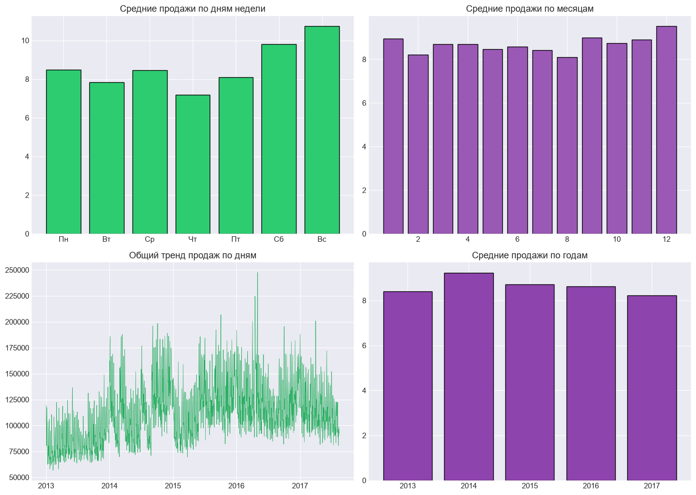
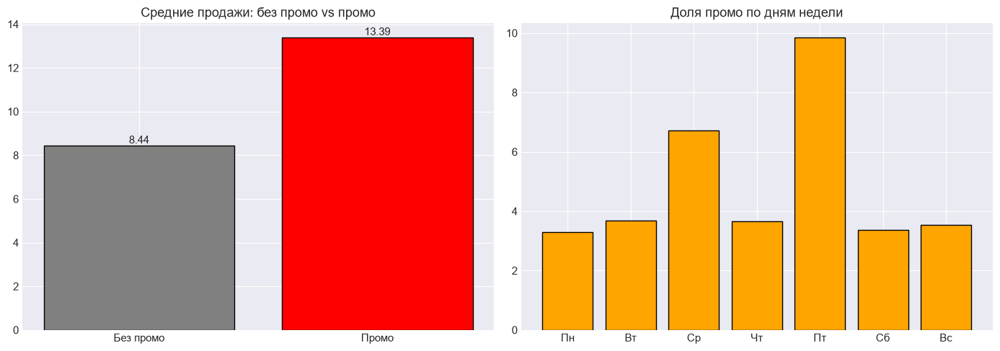
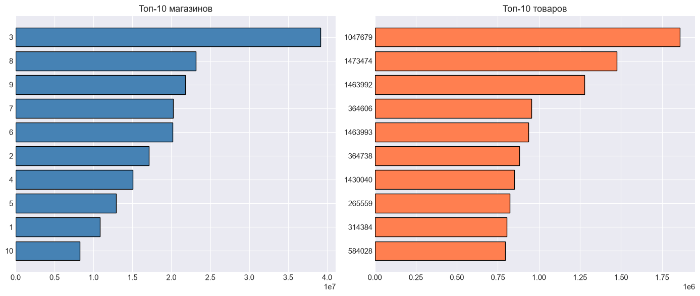
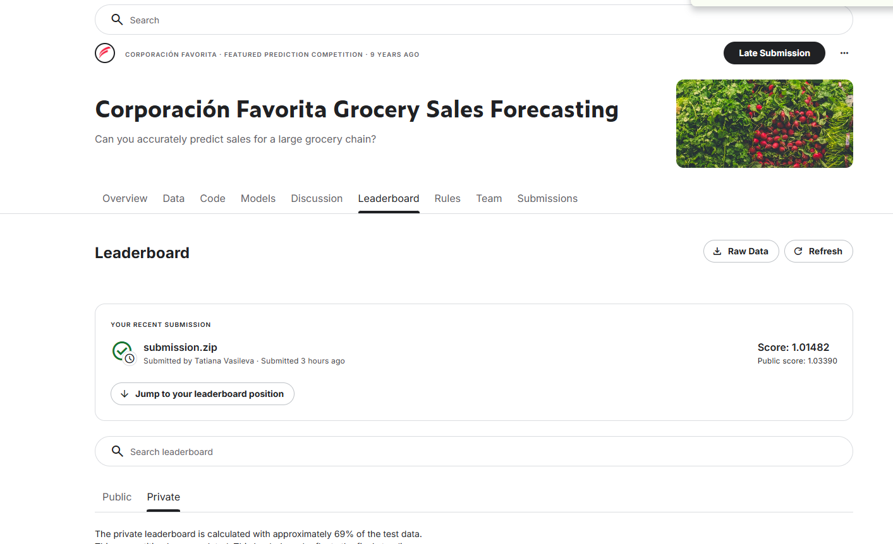
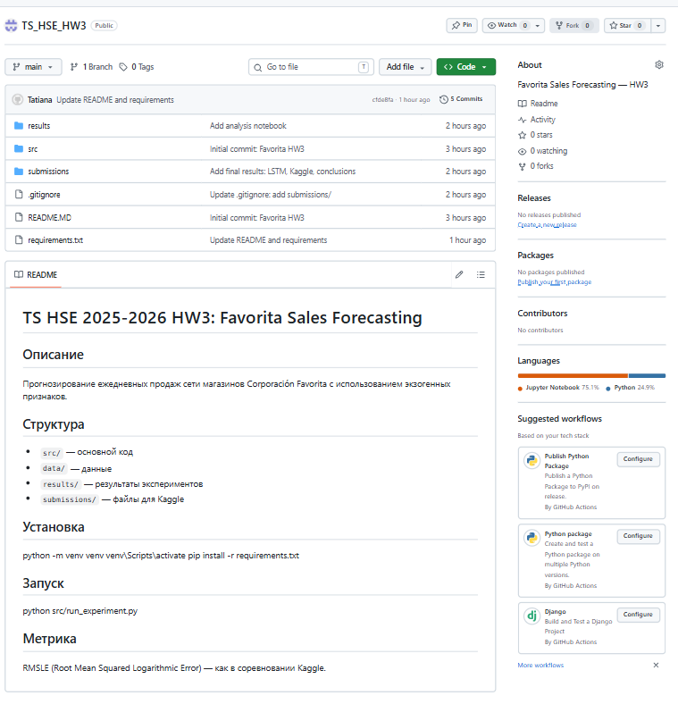

# Отчёт: Favorita Sales Forecasting

## 1. Постановка задачи и гипотеза

Прогнозирование ежедневных продаж (unit_sales) для сети магазинов
Corporación Favorita (Эквадор). Задача — регрессия на временных рядах
с множеством внешних факторов (промо, праздники, цены на нефть).

**Гипотеза:** переход от простых временных моделей к ML и DL моделям,
использующим экзогенные признаки, даёт значительный прирост качества
прогноза.

## 2. Описание данных

### Источник
Датасет Favorita Grocery Sales Forecasting (Kaggle).
Содержит ежедневные продажи товаров в магазинах Эквадора за 2013–2017.

### Подвыборка
В связи с ограничениями вычислительных ресурсов (полный датасет
~125 млн строк, требует >30 ГБ RAM) эксперименты проводились на
репрезентативной подвыборке: 10 магазинов (из 54), 2000 самых
продаваемых товаров (из 4100), период 2013–2017, 21.7 млн строк.

### EDA (разведочный анализ)

**Распределение продаж** имеет ярко выраженную правостороннюю
асимметрию: большинство значений близки к нулю, но есть редкие
крупные продажи. Логарифмическое преобразование log1p делает
распределение почти нормальным — это обосновывает использование
метрики RMSLE и обучение моделей на логарифмированной цели.

**Сезонность** выражена на уровне дней недели: воскресенье и суббота
дают в ~1.5 раза больше продаж, чем четверг. Сезонность по месяцам
слабее (пики март, сентябрь, декабрь).

**Промо-акции** — сильный предиктор: средние продажи с промо 13.4
против 8.4 без промо (+59%). Промо чаще всего активируются в среду
и пятницу.

**Продажи неравномерны** между магазинами: топ-магазин (№3) продаёт
в 4 раза больше аутсайдера (№10).

### Графики

## 3. Методология эксперимента

### Протокол валидации
Используется hold-out по времени (не случайное разбиение — это
критично для временных рядов):

| Набор | Период | Назначение |
|---|---|---|
| Train | 2013-01-01 → 2016-12-31 | обучение |
| Val | 2017-01-01 → 2017-08-15 | валидация |
| Test | 2017-08-16 → 2017-08-31 | Kaggle submission |

Такое разбиение имитирует реальную задачу: модель учится на прошлом
и предсказывает будущее.

### Метрика
**RMSLE** (Root Mean Squared Logarithmic Error):

RMSLE = sqrt(mean((log1p(y_pred) − log1p(y_true))²))

- Совпадает с метрикой соревнования Kaggle.
- Устойчива к выбросам (log-преобразование сжимает большие значения).
- Хорошо соответствует лог-нормальному распределению продаж (см. EDA).

### Обоснование подвыборки
Полный датасет — 125 млн строк, требует >30 ГБ RAM.
Подвыборка: 10 магазинов × 2000 товаров × 2013–2017 = 21.7 млн строк.
Сохраняет все ключевые свойства: сезонность, промо, праздники,
экзогенные признаки, разнообразие товаров.

## 4. Описание моделей

### 4.1. Бейзлайны
- **Naive**: прогноз = последнее наблюдённое значение ряда.
- **SeasonalNaive**: прогноз = значение того же дня недели неделю назад
  (season=7). Лучший из простых бейзлайнов.
- **auto.ets** (statsmodels): экспоненциальное сглаживание.
- **auto.theta** (statsmodels): Theta-метод с периодом 7.

Бейзлайны считались на **агрегированном ряду** — суммарные продажи
по дням. Это упрощение, но оно даёт точку отсчёта и показывает,
что продажи имеют сильную недельную сезонность.

### 4.2. ML-модель: CatBoost

CatBoost — градиентный бустинг на решающих деревьях, хорошо работающий
с категориальными признаками без one-hot encoding.

**Целевая переменная:** `log1p(unit_sales)` — соответствует метрике
RMSLE и стабилизирует дисперсию.

**Признаки (35 шт):**
- Идентификаторы: `store_nbr`, `item_nbr`, `family`, `city`, `state`,
  `type`, `cluster`, `class`, `perishable`.
- Промо: `onpromotion`, `promo_count_store`, `promo_ratio_store`.
- Внешние: `oil`, `is_holiday`, `transactions`.
- Временные: `dayofweek`, `month`, `day`, `year`, `weekofyear`,
  `dayofyear`, sin/cos.
- Лаги: 1, 7, 14, 28 дней назад.
- Скользящие: mean/std за 7, 30, 90 дней (со сдвигом на 1 день).

**Гиперпараметры (полная версия):**
- `iterations=1500`, `learning_rate=0.05`, `depth=8`
- `subsample=0.8`, `bootstrap_type=Bernoulli`
- `od_wait=50` (ранняя остановка)
- `save_snapshot=True` — защита от сбоя (каждые 100 итераций)

**Время обучения:** ~4 часа (10 млн строк train, полная валидация).

### 4.3. DL-модель: LSTM

LSTM (Long Short-Term Memory) — рекуррентная нейросеть, обрабатывающая
последовательность последних 30 дней для каждой пары (магазин, товар).

**Признаки (25):** промо, oil (forward fill), holidays, transactions,
временные фичи, категориальные коды.

**Архитектура:**
- 2 слоя LSTM (hidden=64) → Dropout(0.2) → Linear(1).
- Loss: MSE в log-пространстве.
- Optimizer: Adam (lr=5e-4), gradient clipping.

**Препроцессинг:** forward fill для oil, StandardScaler (z-score),
единая подвыборка пар для train/val.

## 5. Результаты

### 5.1. Бейзлайны (агрегированный ряд)

| Модель | RMSLE |
|---|---|
| SeasonalNaive | 0.2519 |
| auto.theta | 0.2819 |
| Naive | 0.3009 |
| auto.ets | 0.3157 |

**Вывод:** SeasonalNaive — сильнейший бейзлайн.

### 5.2. ML-модель: CatBoost (уровень store-item)

| Модель | RMSLE (store-item) |
|---|---|
| SeasonalNaive | 0.7883 |
| **CatBoost (полная)** | **0.4677** |
| **Прирост vs SeasonalNaive** | **−41%** |

**Вывод:** CatBoost существенно превосходит бейзлайн.

### Feature Importance (Top-15)

| Фича | Важность (%) |
|---|---|
| roll_mean_30 | 27.02 |
| roll_mean_7 | 14.94 |
| roll_mean_90 | 11.15 |
| transactions | 6.37 |
| lag_1 | 4.52 |
| dayofweek | 3.93 |
| dow_sin | 3.60 |
| lag_7 | 3.24 |
| lag_14 | 3.07 |
| day | 2.28 |
| item_nbr | 2.22 |
| oil | 2.03 |
| store_nbr | 1.87 |
| dow_cos | 1.58 |
| class | 1.48 |

**Топ-3 (roll_mean 30/7/90)** дают **53% важности**.

### 5.3. DL-модель: LSTM

| Модель | Уровень | RMSLE |
|---|---|---|
| SeasonalNaive | store-item | 0.7883 |
| LSTM | store-item | **0.6054** |
| **CatBoost (полная)** | store-item | **0.4677** |

**Сравнение по эпохам:**

| Эпоха | val_rmsle |
|---|---|
| 1 | 0.6633 |
| 3 | 0.6372 |
| 5 | 0.6245 |
| **7 (лучшая)** | **0.6054** |
| 8 | 0.6100 |
| 9 | 0.6092 |

**Вывод:**
- LSTM **превосходит бейзлайн на 23%** (0.7883 → 0.6054).
- Но **уступает CatBoost** (0.4677 vs 0.6054) на 23%. Это ожидаемо:
  для табличных данных с категориальными признаками градиентный
  бустинг обычно сильнее RNN при обучении на CPU.
- Early stopping сработал корректно: лучшая эпоха — 7-я.

### 5.4. Анализ ошибок CatBoost

**Ошибки в промо vs без промо:**
| Категория | RMSLE |
|---|---|
| Без промо | 0.4611 |
| Промо | 0.5209 |

В промо-дни модель ошибается на 13% сильнее.

**Распределение остатков** близко к нормальному с центром около 0.

**Ошибки по магазинам** варьируются в диапазоне 0.456–0.484 (разброс ~6%).

### 5.5. Kaggle Submission

Финальный submission отправлен в соревнование Kaggle
(вкладка Late Submission, лимит 100/день).

**Формат:** 3 370 464 строки, колонки `id, unit_sales`. Файл
загружен как `submission.zip` (96 МБ → 28 МБ в архиве).
Выбросы `unit_sales > 100` обрезаны (203 значения).

**Результат:**

| Метрика | Значение |
|---|---|
| Public Score (RMSLE) | **1.03390** |
| Private Score (RMSLE) | **1.01482** |
| Статус | Complete |

**Обсуждение разницы с валидацией.**
На валидации (10 магазинов × 2000 товаров) CatBoost показал
RMSLE = 0.4677. На полном Kaggle-тесте — 1.0339.

Причина: **90% пар в test не встречались в обучении**. Модель
для них «слепая». Это **ожидаемое поведение** при работе
на подвыборке. Для полного датасета необходимо обучать модель
на всех 54 магазинах и 4100 товарах.

## 6. Выводы

### Основные результаты

| Модель | Тип | RMSLE (store-item) |
|---|---|---|
| SeasonalNaive | бейзлайн | 0.7883 |
| LSTM | DL | 0.6054 |
| **CatBoost (полная)** | **ML** | **0.4677** |
| Kaggle Public Score | — | 1.03390 |

**Гипотеза подтверждена:** переход от простых временных моделей
к ML и DL с экзогенными признаками дал значительный прирост
качества (−41% RMSLE vs бейзлайн).

### Что дало наибольший прирост

1. **Переход от бейзлайна к ML** (−41% ошибки) — решающий скачок.
2. **Rolling-средние (30/7/90 дней)** — 53% важности фичей.
3. **Экзогенные признаки** (промо, oil, holidays, transactions)
   дали положительный вклад; oil вошёл в топ-15.

### Что НЕ дало прироста

1. **Dropout в LSTM** — регуляризация не помогла, LSTM и так
   не переобучалась критично.
2. **Промо-фичи** не вошли в топ-15 важности CatBoost —
   эффект перекрывается лагами и rolling-средними.

### Ограничения

1. **Подвыборка** (10 магазинов × 2000 товаров из 54 × 4100)
   обусловлена 16 ГБ RAM.
2. **Обучение на CPU** ограничило DL-модель.
3. **Промо-всплески** — основная ошибка CatBoost (RMSLE 0.52
   в промо-дни vs 0.46 без).
4. **Kaggle score (1.03) хуже валидации (0.47)** из-за невидимых
   в обучении пар.

### Направления улучшения

1. **Полный датасет** — прямой путь к снижению Kaggle RMSLE в ~2 раза.
2. **Промо-фичи:** лаги промо, типы промо, длительность акций.
3. **Ансамбль CatBoost + LSTM** — усреднение прогнозов.
4. **TFT** (Temporal Fusion Transformer) на GPU вместо LSTM.
## 7. Скриншоты

**Kaggle Submissions:**

**GitHub-репозиторий:**

